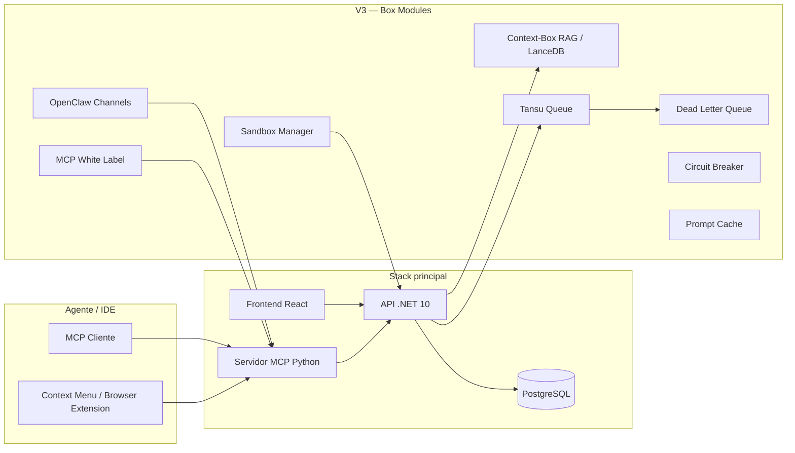

# Sistemas — visão geral

O repositório **Briefapp Todo List** agrupa vários subsistemas que, juntos, formam uma plataforma **humano + agente** para Scrum, conhecimento, RAG e orquestração de agentes autônomos.

## Diagrama lógico (V3 — Box Architecture)

## Lista de sistemas

| Sistema | Pasta / artefato | Função |
|---------|-------------------|--------|
| **API** | `backend/AgenticTodoList.Api` | REST, domínio Scrum, wiki, checkpoints, Box modules, sandboxes, DLQ, circuit breaker, queues |
| **Frontend** | `frontend` | Dashboard, kanban, conhecimento, token insights |
| **MCP** | `mcp-server-python` | Ponte Model Context Protocol → API (ferramentas e recursos para agentes) |
| **PostgreSQL** | `docker-compose` + `ops/postgres` | Persistência; backups agendados e scripts em `ops/scripts` |
| **Context-Box RAG** | RAG pipeline (API + LanceDB) | Ingestão, chunking, embedding e busca semântica de documentos para boxes |
| **Tansu Queue** | Event queue (API) | Fila de tasks por box com publish/subscribe, retries e DLQ |
| **Sandbox Manager** | Sandboxes Docker | Containers isolados por box para execução segura de código |
| **OpenClaw** | Channels inbound | Gateway de mensagens multi-canal (WhatsApp, Slack, Telegram) |
| **Prompt Cache** | Cache de segmentos | Reutilização de system prompts/tool definitions entre chamadas LLM |
| **MCP White Label** | Per-box MCP servers | Instâncias MCP isoladas por box com tools/resources dedicados |
| **Context Menu** | `extensions/windows-context-menu` | Menu de contexto Windows para enviar arquivos ao Context-Box |
| **Browser Scrapper** | `extensions/browser-scrapper` | Extensão Chrome para captura de conteúdo web |

## Portas (Docker Compose — stack principal)

| Serviço | Porta host |
|---------|------------|
| Frontend | 8400 |
| API | 8480 |
| MCP | 8481 |
| PostgreSQL | 8432 |

## V3 — Box Architecture

A V3 introduziu o conceito de **Box** como unidade isolada de projeto/agente. Cada Box pode ter:

- **Context-Box RAG**: pipeline de ingestão e busca semântica (extract → split → embed → LanceDB)
- **Task Queue**: fila Tansu com publish, lock, ACK/NACK e DLQ automática
- **Sandbox**: container Docker isolado com controle de CPU/RAM/rede e TTL
- **Circuit Breaker**: FSM (Closed → Open → Half-Open) por box para resiliência
- **OpenClaw**: canais de mensagem inbound com routing por box
- **Prompt Cache**: segmentos cacheáveis (system prompt, tools, context) com hit/miss tracking
- **MCP White Label**: servidor MCP isolado por box com porta dedicada

## Decisão de fronteiras

- O **núcleo operacional** (tarefas, sprints, wiki) vive na API + Postgres; o MCP apenas **proxy** autenticado pela rede interna do compose.
- Os **Box modules** (RAG, sandbox, queue, etc.) são orquestrados pela API e expostos ao MCP via tools dedicadas.
- As **extensões** (context menu, browser scrapper) comunicam diretamente com o MCP server via JSON-RPC.
